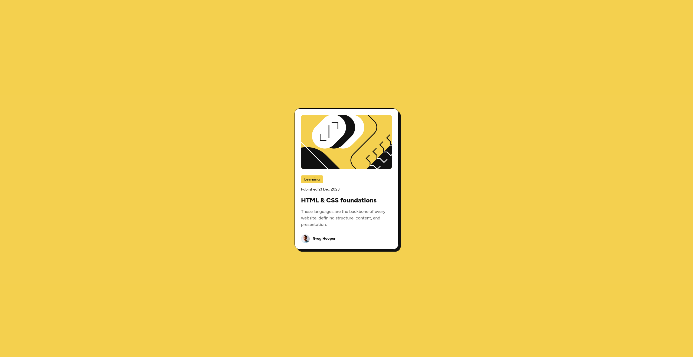

# Frontend Mentor - Blog preview card solution

This is a solution to the [Blog preview card challenge on Frontend Mentor](https://www.frontendmentor.io/challenges/blog-preview-card-ckPaj01IcS). Frontend Mentor challenges help you improve your coding skills by building realistic projects. 

## Table of contents

- [Overview](#overview)
  - [Screenshot](#screenshot)
  - [Links](#links)
- [My process](#my-process)
  - [Built with](#built-with)
- [Author](#author)

## Overview

### Screenshot

### Links

[//]: # (- [Solution URL]&#40;https://www.frontendmentor.io/solutions/qr-code-using-html-and-css-with-flexbox-uXJ6cxeiMU&#41;)
- [Live Site](https://blog-preview.fm.gavinfenton.com)

## My process

### Built with

- Basic HTML & CSS
- CSS variables
- Flexbox

## Author

- Website - [Gavin Fenton](https://gavinfenton.com)
- Frontend Mentor - [@GavinF14](https://www.frontendmentor.io/profile/GavinF17)
